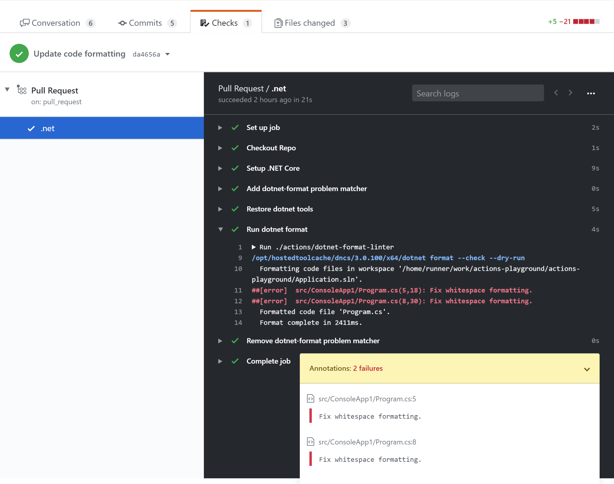

# Problem Matcher for dotnet-format

[](https://github.com/xt0rted/dotnet-format-problem-matcher/actions/workflows/ci.yml)

Adds a problem matcher that will detect errors from [dotnet-format](https://github.com/dotnet/format) and create annotations for them.

## Usage

```yml
on: push
jobs:
  build:
    runs-on: ubuntu-latest
    steps:
      - uses: actions/checkout@v2
      - uses: actions/setup-dotnet@v1
          with:
            dotnet-version: 3.1.101
      - uses: xt0rted/dotnet-format-problem-matcher@v1
      - run: dotnet tool install -g dotnet-format
      - run: dotnet-format --dry-run
```




## Options

Name | Allowed values | Description
-- | -- | --
`action` | `add` (default), `remove` | If the problem matcher should be registered or removed
`use-workspace` | `true` or `false` (default) | Load a version of the problem matcher that works with `dotnet-format`'s workspaces log output

## License

The scripts and documentation in this project are released under the [MIT License](LICENSE)
